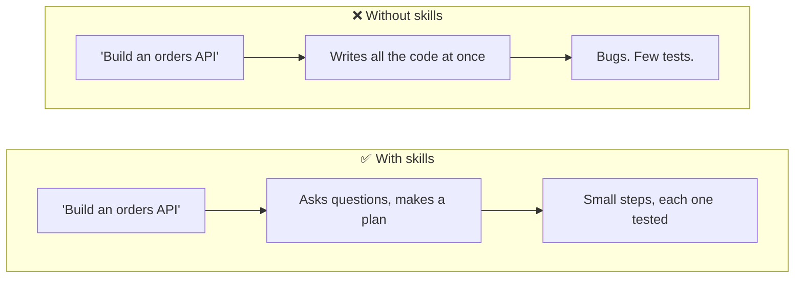
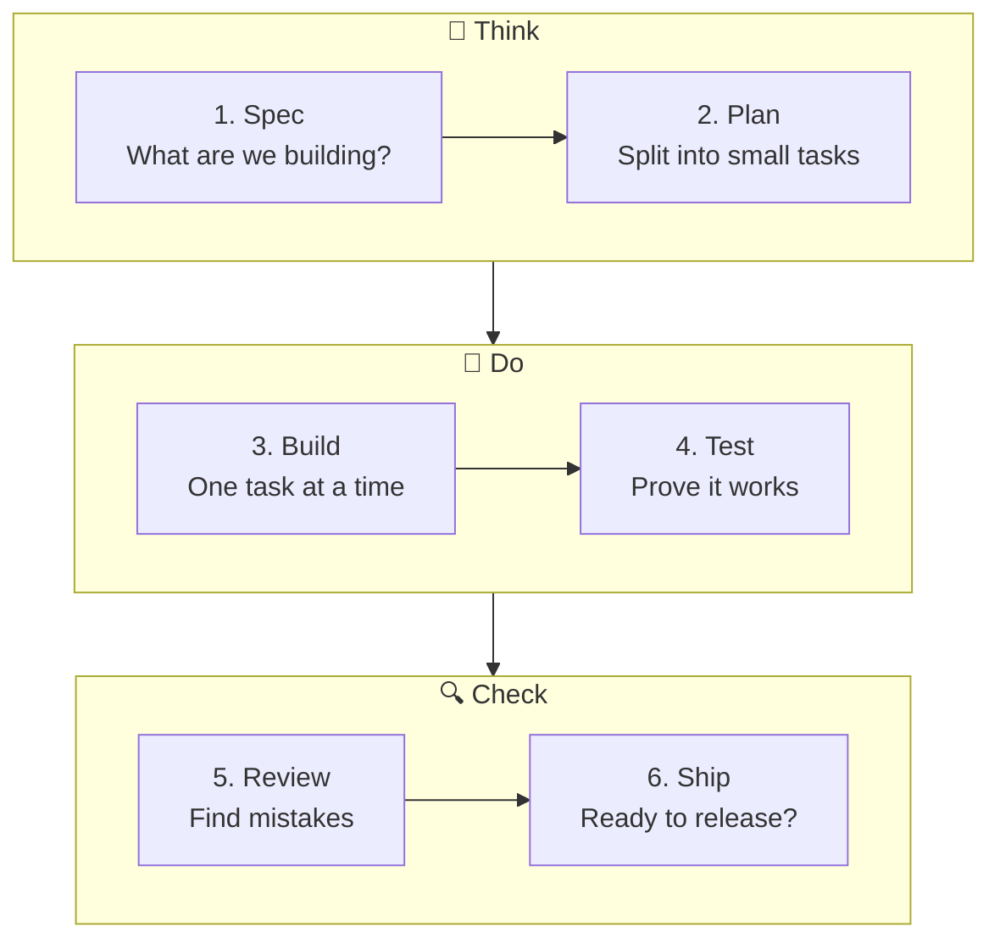
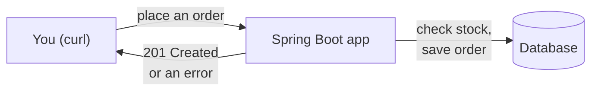
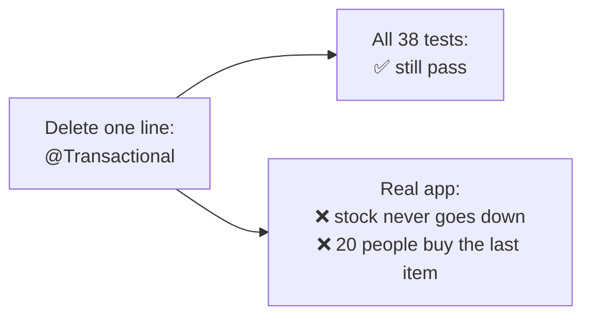

# AI that codes like a senior developer

**A simple demo for Java developers.**

This project shows how [Addy Osmani's agent-skills](https://github.com/addyosmani/agent-skills) make an AI coding assistant (Claude Code) build a Spring Boot feature **properly**: plan first, small steps, tests every time.

🧠 **What are agent skills?** [Agent Skills Explained](https://tpillai.github.io/addysomani-agent-skill-demo/agent-skills.html) covers the lifecycle, what a skill file looks like, the 9 commands and 25 skills, and where each step shows up in this repo.

📖 **Prefer pictures?** Read the [visual guide (PDF)](docs/visual-guide.pdf), an 8-page illustrated walkthrough you can view, download or print.
Want every detail? See the [deep dive](docs/deep-dive.md).

🧭 **New to the codebase?** [Orders Service Evolution](https://tpillai.github.io/addysomani-agent-skill-demo/Orders%20Service%20Evolution.html) walks through the history commit by commit. For each commit it shows an architecture diagram that marks what was added and what changed, plus how `POST /api/orders` and the error responses grew along the way. The source is [Orders Service Evolution.html](Orders%20Service%20Evolution.html) in this repo. A GitHub Action adds new commits to it on every push to `main`.

---

## The idea in one picture

An AI without skills is like an eager intern: it starts typing code immediately.
An AI **with** skills is like a senior developer: it thinks, plans, tests, and asks for review.



**What is a "skill"?** Just a text file of instructions, like a recipe card. The AI reads the right one for the job.

---

## The 6 steps



You trigger each step with a command in Claude Code:

| Step | You type | What you get |
|---|---|---|
| 1. Spec | `/agent-skills:spec` | A design document ([SPEC.md](SPEC.md)) |
| 2. Plan | `/agent-skills:plan` | A to-do list of small tasks ([tasks/todo.md](tasks/todo.md)) |
| 3. Build | `/agent-skills:build` | Code + tests for **one** task, then it stops |
| 4. Test | `/agent-skills:test` | Tests written **before** the code |
| 5. Review | `/agent-skills:review` | A list of problems to fix |
| 6. Ship | `/agent-skills:ship` | A go / no-go checklist |

> 💡 Always type the full name (`/agent-skills:plan`, not `/plan`). Claude Code has its own `/plan` that does something different.

---

## What we built

A tiny shop. You can see products and place orders.



| Request | Answer |
|---|---|
| Order 2 keyboards | ✅ `201 Created`, stock goes 25 → 23 |
| Order a product that doesn't exist | ❌ `404 Not Found` |
| Order 10 monitors, only 8 in stock | ❌ `409 Conflict` "not enough stock" |
| Send broken data | ❌ `400 Bad Request` |

---

## What happened, step by step

1. **Spec.** We gave a 4-line idea. The AI **asked questions first**, e.g. *"What if two people buy the last item at the same time?"* Then it wrote a full design.
2. **Plan.** It split the work into **7 small tasks** (T1–T7) and put the hardest one first.
3. **Build.** It ran 7 times: one task, its tests, then **stop** for us to check. That's 7 small commits instead of 1 giant one.
4. **Review.** It found **3 problems** in its own work and fixed them.
5. **Ship.** It gave a checklist of what's still needed before real customers use it (login, security, etc.).

Result: a working feature with **45 automated tests**.

---

## The biggest lesson 🎓

The review found something surprising:



**Passing tests don't always mean working code.** The tests used fake ("mock") databases, so they couldn't see the bug. The fix was adding one test that uses the **real** database. Now deleting that line makes the tests fail, as it should.

---

## Try it yourself

**You need:** Java 21 and Maven.

**1. Run the app**

```bash
git clone https://github.com/tpillai/addysomani-agent-skill-demo.git
cd addysomani-agent-skill-demo
mvn spring-boot:run
```

**2. Place an order** (in a second terminal)

```bash
curl -X POST localhost:8080/api/orders -H 'Content-Type: application/json' -d '{"lines":[{"productId":1,"quantity":2}]}'
```

**3. Run all the checks**

```bash
scripts/smoke-test.sh
```

You should see `17 passed, 0 failed`.

**4. Use the skills yourself** (needs [Claude Code](https://claude.com/claude-code))

```bash
claude plugin marketplace add addyosmani/agent-skills
claude plugin install agent-skills@addy-agent-skills
```

Then open Claude Code in this folder and follow [TRY-IT.md](TRY-IT.md).

---

## Words you might not know

| Word | Simple meaning |
|---|---|
| **Agent / AI agent** | An AI that can edit files and run commands, not just chat |
| **Skill** | A recipe card telling the AI how to do one kind of job well |
| **Spec** | A short design doc: what to build, and what "done" means |
| **CLAUDE.md** | A note for the AI about your project (how to build, team rules), like onboarding a new teammate |
| **Mock** | A fake object used in tests instead of the real thing |
| **`@Transactional`** | "Do all of this, or none of it." Without it, the stock changes were never saved. |
| **`@Version`** | Stops two people from buying the same last item at the same moment |
| **ProblemDetail** | A standard JSON shape for error messages |

---

## Credits

[addyosmani/agent-skills](https://github.com/addyosmani/agent-skills) by Addy Osmani · [Claude Code](https://claude.com/claude-code) by Anthropic · Spring Boot

This is a learning project, not production code.
