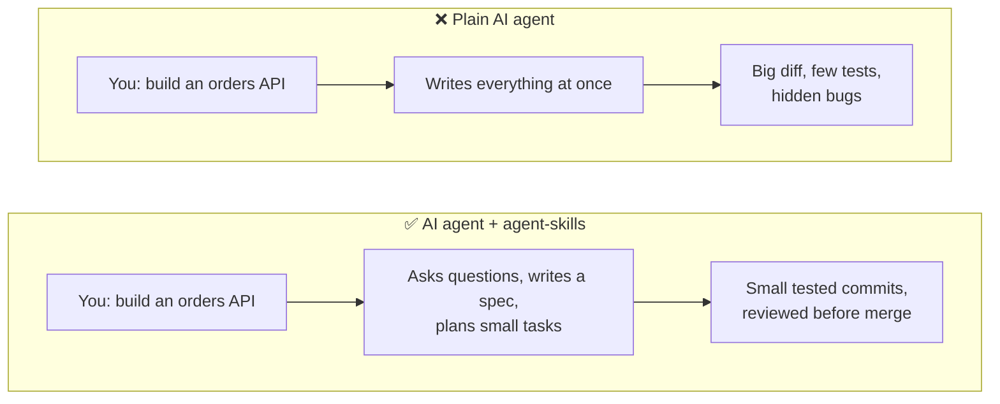
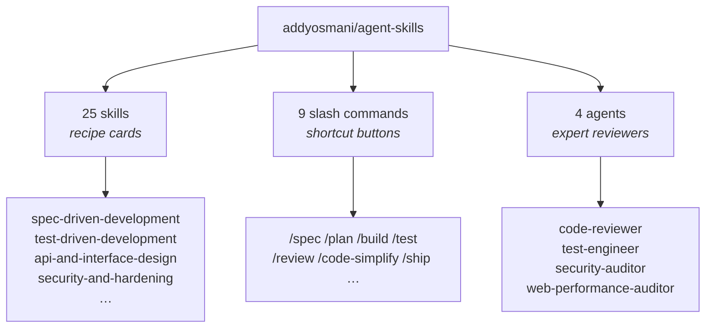
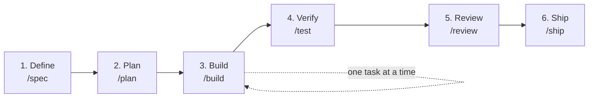
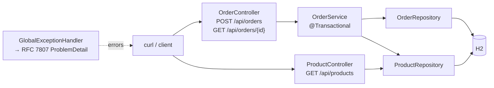
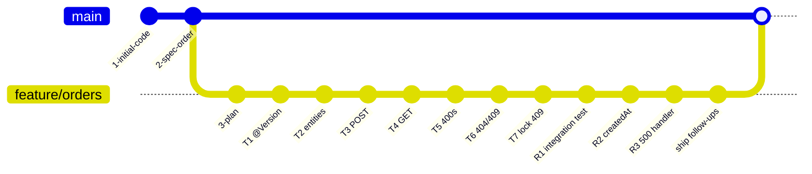
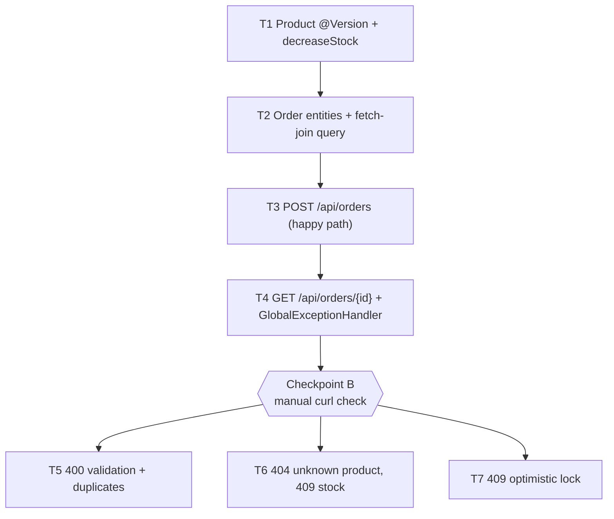
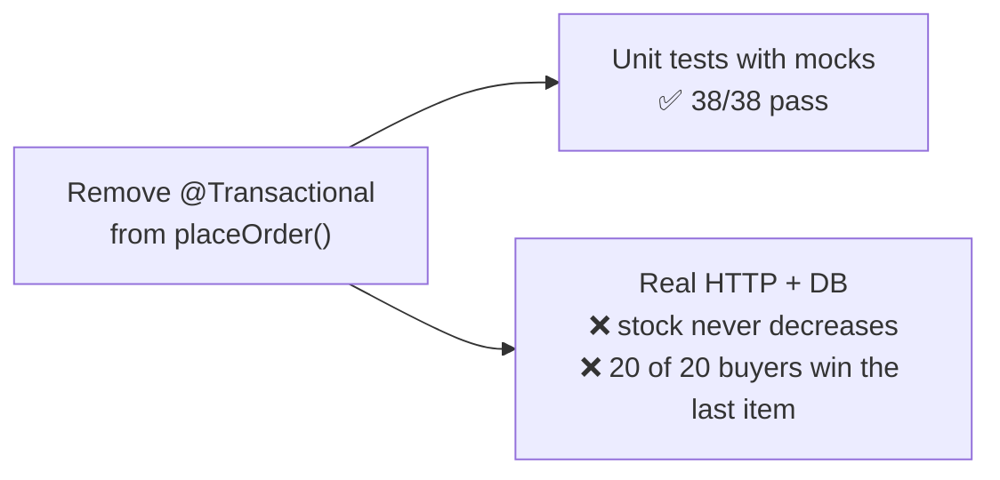
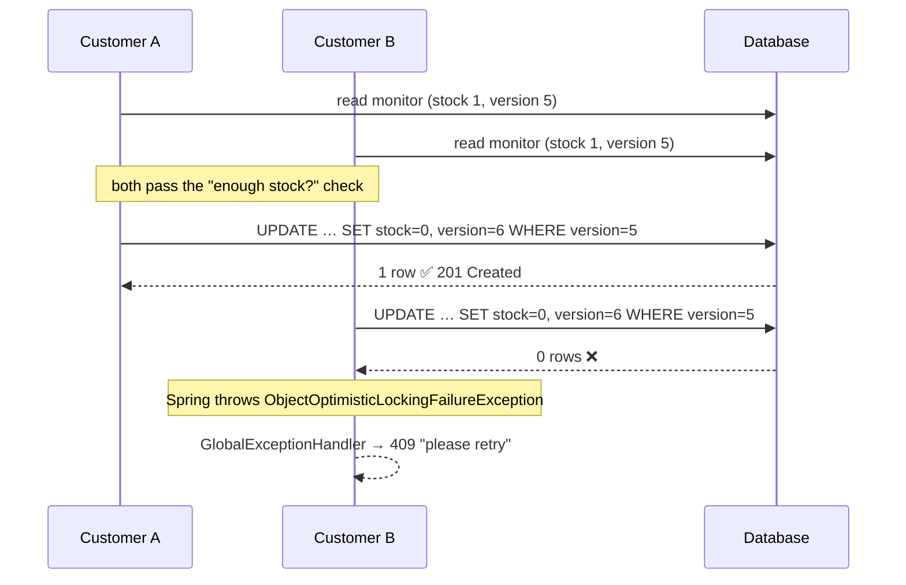

# Agent Skills + Spring Boot: a hands-on demo

A beginner-friendly walkthrough of [addyosmani/agent-skills](https://github.com/addyosmani/agent-skills) used with **Claude Code** on a real **Spring Boot 3.5 / Java 21** project.

This repo contains a small online-shop backend, `orders-service`. Its **orders** feature was built from scratch with the agent-skills workflow, and every step is in the git history so you can follow along.

> **TL;DR** Agent skills make an AI coding agent work like a careful senior engineer: it writes a spec, plans small tasks, builds one task at a time with tests, gets reviewed, and only then ships.

---

## Table of contents

1. [What problem does agent-skills solve?](#1-what-problem-does-agent-skills-solve)
2. [What's in the box](#2-whats-in-the-box)
3. [The workflow at a glance](#3-the-workflow-at-a-glance)
4. [The sample app](#4-the-sample-app)
5. [Quick start](#5-quick-start)
6. [Step-by-step: how the orders feature was built](#6-step-by-step-how-the-orders-feature-was-built)
7. [Lessons for Java developers](#7-lessons-for-java-developers)
8. [Project structure](#8-project-structure)
9. [Cheat sheet](#9-cheat-sheet)
10. [Credits](#10-credits)

---

## 1. What problem does agent-skills solve?

Ask a plain AI agent to *"build an orders API"* and it usually jumps straight into code. Agent skills give the same agent **checklists that senior engineers follow**.



A **skill** is just a Markdown file (`SKILL.md`) containing a workflow. The agent loads it when your request matches, the same way you'd open a runbook before a deployment.

---

## 2. What's in the box



| Part | Java analogy | Example |
|---|---|---|
| **Skill** | A team runbook or coding standard | *test-driven-development*: write a failing test, then the code |
| **Command** | A Maven goal that runs a whole phase | `/agent-skills:build` → implement the next task + `mvn test` + commit |
| **Agent** | A specialist colleague doing a review | *security-auditor* reviews `GlobalExceptionHandler` |

Skills useful for Spring Boot backends include **api-and-interface-design** (REST, status codes, `ProblemDetail`), **security-and-hardening**, **performance-optimization** (N+1 queries, fetch joins), and **observability-and-instrumentation** (Actuator, Micrometer).

---

## 3. The workflow at a glance



| Phase | Command | Output in this repo |
|---|---|---|
| Define | `/agent-skills:spec` | [`SPEC.md`](../SPEC.md): endpoints, JSON, error table, success criteria |
| Plan | `/agent-skills:plan` | [`tasks/plan.md`](../tasks/plan.md) + [`tasks/todo.md`](../tasks/todo.md): 7 small tasks |
| Build | `/agent-skills:build` | One commit per task (T1–T7), each with tests |
| Verify | `/agent-skills:test` | Test-first changes (red → green) |
| Review | `/agent-skills:review` | 3 findings (R1–R3), each fixed in its own commit |
| Ship | `/agent-skills:ship` | Go/no-go checklist + follow-ups in `tasks/todo.md` |

> **⚠️ Name clash:** Claude Code has its own built-in `/plan` (plan mode). Always use the full names, such as `/agent-skills:plan` and `/agent-skills:review`, so you know which one runs.

---

## 4. The sample app

A tiny shop API on an in-memory H2 database, seeded with 3 products.



| Endpoint | Success | Errors |
|---|---|---|
| `GET /api/products` | 200 list | none |
| `GET /api/products/{id}` | 200 | 404 |
| `POST /api/orders` | **201** + `Location` header | 400 invalid input / duplicate product · 404 unknown product · 409 not enough stock or concurrent update |
| `GET /api/orders/{id}` | 200 | 404 |

Example:

```bash
curl -i -X POST localhost:8080/api/orders \
  -H 'Content-Type: application/json' \
  -d '{"lines":[{"productId":1,"quantity":2}]}'
```
```json
{
  "id": 1,
  "createdAt": "2026-10-04T11:40:27.748320Z",
  "lines": [
    { "productId": 1, "productName": "Mechanical keyboard",
      "unitPrice": 89.99, "quantity": 2, "lineTotal": 179.98 }
  ],
  "total": 179.98
}
```

An error looks like this (RFC 7807 `ProblemDetail`):

```json
{
  "type": "about:blank",
  "title": "Conflict",
  "status": 409,
  "detail": "Insufficient stock for product 3: requested 10, available 8",
  "instance": "/api/orders",
  "productId": 3, "requested": 10, "available": 8
}
```

---

## 5. Quick start

### Prerequisites

- Java 21+
- Maven 3.9+
- [Claude Code](https://claude.com/claude-code), only if you want to try the skills yourself

### Run the app

```bash
git clone https://github.com/tpillai/addysomani-agent-skill-demo.git
cd addysomani-agent-skill-demo
mvn clean verify          # build + 45 tests
mvn spring-boot:run       # http://localhost:8080
```

Then in a second terminal:

```bash
curl localhost:8080/api/products
scripts/smoke-test.sh     # 17 PASS/FAIL checks, including a 20-buyer race
```

> The smoke test places real orders and sells product 3 down to 0, so restart the app before running it again.

### Install agent-skills in Claude Code

```bash
claude plugin marketplace add addyosmani/agent-skills
claude plugin install agent-skills@addy-agent-skills
```

Start a **new** Claude Code session in the project folder and type `/`. You should see the `agent-skills:` commands.

### Try it yourself

Check out the commit before the feature existed and rebuild it with the skills:

```bash
git checkout -b my-try ec0b4ae    # the spec exists, no order code yet
```

Then follow [`TRY-IT.md`](../TRY-IT.md).

---

## 6. Step-by-step: how the orders feature was built

### Git history = the workflow



### Step 0: give the agent context with `CLAUDE.md`

Before using any skill, the project gets a [`CLAUDE.md`](../CLAUDE.md), the agent's equivalent of an onboarding doc. Without it, `/test` doesn't know whether you use Maven or Gradle.

```markdown
## Commands
- Build + all tests: `mvn clean verify`
- Single test: `mvn test -Dtest=ProductControllerTest#listsProducts`

## Conventions
- Layers: controller → service → repository
- DTOs are Java records; never return JPA entities from controllers
- Errors: @RestControllerAdvice returning ProblemDetail (RFC 7807)
- Money is BigDecimal, never double
```

**This is the most important step for Java projects.** The skills are language-agnostic, and `CLAUDE.md` is what makes them write idiomatic Spring code.

### Step 1: `/agent-skills:spec` → `SPEC.md`

Input: a 4-line feature request. Before writing anything, the skill **asked questions**:

- *What happens when two customers buy the last item at once?* → optimistic locking, 409
- *Same product on two lines?* → reject with 400
- *Which price goes on the order?* → copy the price at order time

Output: [`SPEC.md`](../SPEC.md) with the API contract, an error table, data model, testing strategy, **boundaries** (always / ask first / never), what's out of scope, and **8 success criteria**.

### Step 2: `/agent-skills:plan` → `tasks/`

The spec was split into **vertical slices**. Each task is a thin piece that works end to end, rather than "all entities first, then all services":



Each task has acceptance criteria, exact test commands, a file list and a size. The **riskiest task (locking) comes first**.

### Step 3: `/agent-skills:build`, one task per run

Each run implements **one** task, runs `mvn test`, ticks the box in `todo.md`, commits and **stops**. You review, then run it again.

| Task | What it added | Tests after |
|---|---|---|
| T1 | `@Version` on `Product`, `decreaseStock()`, a test proving a stale update fails | 9 |
| T2 | `Order`, `OrderLine`, `findWithLinesById` (one query, no N+1), `OrderResponse` | 12 |
| T3 | `POST /api/orders`: validation, price copy, stock decrement, 201 + `Location` | 17 |
| T4 | `GET /api/orders/{id}`, first `@RestControllerAdvice` | 21 |
| T5 | 400 `ProblemDetail` with a field `errors` list, duplicate check | 32 |
| T6 | 404 unknown product, 409 insufficient stock, **all checks before any change** | 37 |
| T7 | `ObjectOptimisticLockingFailureException` → 409 (written test-first) | 38 |

### Step 4: `/agent-skills:review`

A five-axis review: correctness, readability, architecture, security, performance. It found:

| # | Finding | Fix |
|---|---|---|
| R1 | **All 38 tests still passed with `@Transactional` removed**, because unit tests mocked the repositories | New `@SpringBootTest` integration test against the real database. It fails if `@Transactional` is removed. |
| R2 | POST and GET could return different `createdAt` on Linux (nanoseconds vs H2's microseconds) | Injected `Clock`, truncated to microseconds |
| R3 | Unexpected exceptions returned Spring's default error body, not `ProblemDetail` | Catch-all handler: logs the error, returns a generic 500 |

Result: **45 tests**.

### Step 5: `/agent-skills:ship`

A pre-launch checklist run by specialist reviewers in parallel. It gave a go for merging as a demo and recorded the open items in [`tasks/todo.md`](../tasks/todo.md):

- **Fix soon**, e.g. fractional `quantity` (`1.9`) is silently truncated to `1`
- **Before any real deployment**, e.g. the H2 console is enabled, there's no authentication or rate limit, and there's no CVE scan
- **Cleanups**: optional tidy-ups

Then `feature/orders` was merged into `main`.

---

## 7. Lessons for Java developers

### 💡 1. Green unit tests don't prove persistence

The most valuable finding of the whole exercise:



Without a transaction, the `Product` entities aren't managed, so `decreaseStock()` changes only Java objects and nothing is saved. Mocks can't see that. **Keep at least one `@SpringBootTest` per critical write path.**

### 💡 2. Two layers stop overselling



1. **Stock check** in `OrderService` catches most cases: *"requested 1, available 0"*.
2. **`@Version`** catches requests that arrive at exactly the same moment, which the stock check alone can't stop.

In the smoke test's race, 20 parallel buyers for 1 monitor gave exactly **1 × 201 and 19 × 409**, every time.

### 💡 3. `open-in-view: false` shapes your service

Lazy collections can't be read in the controller, so `OrderService` builds the `OrderResponse` **inside** the transaction, and `OrderRepository` uses a `join fetch` query. The plan recorded this as a deliberate decision.

### 💡 4. Treat the agent like a junior colleague

- Give it a `CLAUDE.md` (an onboarding doc)
- Ask for a spec before code (a design review)
- Make it work in small commits (easy to review and revert)
- Check its work at the checkpoints yourself (`curl`, smoke test)

---

## 8. Project structure

```
.
├── CLAUDE.md                 ← context for the AI agent (commands, conventions)
├── SPEC.md                   ← output of /spec
├── TRY-IT.md                 ← exercise: rebuild the feature yourself
├── tasks/
│   ├── plan.md               ← output of /plan (decisions, risks, dependency graph)
│   └── todo.md               ← task checklist + review/ship follow-ups
├── scripts/
│   └── smoke-test.sh         ← 17 checks against a running app
└── src/
    ├── main/java/com/example/orders/
    │   ├── product/          ← Product (@Version), controller, repository
    │   ├── order/            ← Order, OrderLine, OrderService, OrderController, exceptions
    │   └── web/              ← GlobalExceptionHandler (ProblemDetail)
    └── test/java/com/example/orders/
        ├── order/            ← unit, @WebMvcTest, @DataJpaTest, @SpringBootTest
        └── product/          ← unit + optimistic-lock test
```

---

## 9. Cheat sheet

| I want to… | Type in Claude Code |
|---|---|
| Describe a new feature | `/agent-skills:spec <what you want>` |
| Break it into tasks | `/agent-skills:plan` |
| Build the next task | `/agent-skills:build` |
| Build all tasks in one go | `/agent-skills:build auto` (only after doing it step by step once) |
| Write tests first for a change | `/agent-skills:test <behaviour>` |
| Review the branch | `/agent-skills:review` |
| Clean up without changing behaviour | `/agent-skills:code-simplify` |
| Pre-launch checklist | `/agent-skills:ship` |
| Ask a specialist | *"use the agent-skills:security-auditor agent on the order endpoints"* |

| I want to… | Run in a terminal |
|---|---|
| Build and test | `mvn clean verify` |
| Run one test | `mvn test -Dtest=OrderServiceTest` |
| Start the app | `mvn spring-boot:run` |
| Smoke test the running app | `scripts/smoke-test.sh` |
| Inspect the database | http://localhost:8080/h2-console (JDBC URL `jdbc:h2:mem:orders`) |

---

## 10. Credits

- [addyosmani/agent-skills](https://github.com/addyosmani/agent-skills) by Addy Osmani (MIT)
- [Claude Code](https://claude.com/claude-code) by Anthropic
- Spring Boot, Hibernate, H2

This is a learning project. See [`tasks/todo.md`](../tasks/todo.md) for what would be needed before production.
